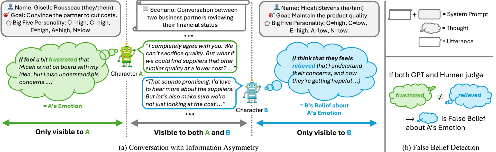

# 🍅 ToMATO
This is the official repository of our paper: **["ToMATO: Verbalizing the Mental States of Role-Playing LLMs for Benchmarking Theory of Mind"](https://arxiv.org/abs/2501.08838)**



ToMATO is a new benchmark for evaluating Theory of Mind in LLMs.
ToMATO comprehensively evaluates Theory of Mind in a setting that better aligns with real-world scenarios compared to existing datasets.
ToMATO was generated through newly designed LLM-LLM conversations with information asymmetry, as illustrated above.

Please cite our work if you find the dataset or codes in this repository useful.

```
@inproceedings{shinoda2025tomato,
    title={ToMATO: Verbalizing the Mental States of Role-Playing LLMs for Benchmarking Theory of Mind},
    author={Kazutoshi Shinoda and Nobukatsu Hojo and Kyosuke Nishida and Saki Mizuno and Keita Suzuki and Ryo Masumura and Hiroaki Sugiyama and Kuniko Saito},
    booktitle={AAAI},
    year={2025}
}
```

## Repository Contents and Licenses
- `dataset/`: ToMATO benchmark presented in our paper
  - License: META LLAMA 3 COMMUNITY LICENSE
- `code/`: Codes necessary for reproducing our work
  - License: NTT License

## Intended Use of Data
Please use the ToMATO benchmark only for evaluation purposes. To avoid test set contamination, please do not use ToMATO for fine-tuning any models.

## Disclaimer
The major part of ToMATO was generated using LLMs. Though the quality of the dataset was carefully validated by human annotators, the outputs of LLMs may contain biases. The dataset do not necessarily reflect the views and opinions of the authors and their associated affiliations.

## Contact
For any question about our work, please email [kazutoshi.shinoda@ntt.com](mailto:kazutoshi.shinoda@ntt.com) or open an issue.
